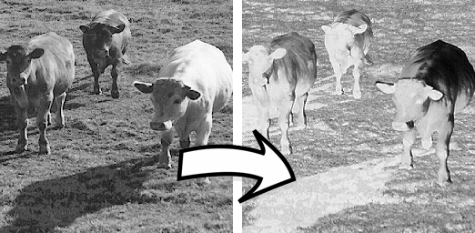

# Practica I: TDA Imagen


## Introducción

Este proyecto se centra en la implementación de un conjunto de programas diseñados para trabajar con imágenes en formato PGM. Creados como parte de la Práctica I para el tratamiento de imágenes, estos programas utilizan un Tipo de Dato Abstracto (TDA) llamado "Imagen".

Los ejecutables resultantes de este trabajo abordan diversas operaciones, desde la generación de negativos hasta la modificación de contraste, recorte de subimágenes, barajado de filas y ampliación de imágenes. Además, se han desarrollado métodos específicos para el TDA Imagen, como la inversión de colores, ajuste de contraste, recorte, zoom, cálculo de medias, barajado de filas y submuestreo.

La documentación detallada de cada programa y método proporciona una guía completa para entender y utilizar estas herramientas de manipulación de imágenes, ofreciendo a los usuarios una gama versátil de funciones para trabajar eficientemente con imágenes en el formato PGM.

## Ejecutables

### Negativo



Calcula el negativo de una imagen:

```bash
negativo <FichImagenOriginal> <FichImagenDestino>
```

- `<FichImagenOriginal>`: Imagen PGM a la que se va a calcular el negativo
- `<FichImagenDestino>`: Imagen PGM resultado de calcular el negativo

### Cambio de Contraste


Cambia el contraste de una imagen:

```bash
contraste <FichImagenOriginal> <FichImagenDestino> <e1> <e2> <s1> <s2>
```

- `<FichImagenOriginal>`: Imagen PGM a la que se va a cambiar el contraste
- `<FichImagenDestino>`: Imagen PGM resultado de cambiar el contraste
- `<e1> <e2>`: Umbral inferior y superior de la imagen de entrada
- `<s1> <s2>`: Umbral inferior y superior de la imagen de salida

### Subimagen


Genera una subimagen a partir de otra:

```bash
subimagen <FichImagenOriginal> <FichImagenDestino> <fila> <col> <filas_sub> <cols_sub>
```

- `<FichImagenOriginal>`: Imagen PGM que se quiere recortar
- `<FichImagenDestino>`: Imagen PGM ya recortada
- `<fila> <col>`: Fila y columna iniciales para recortar
- `<filas_sub> <cols_sub>`: Número de filas y columnas

### Barajar

Baraja o desbaraja una imagen PGM:

```bash
barajar <FichImagenOriginal> <FichImagenDestino>
```

- `<FichImagenOriginal>`: Imagen PGM a ser barajada
- `<FichImagenDestino>`: Imagen PGM ya barajada

### Zoom


Genera una imagen ampliada de otra:

```bash
zoom <FichImagenOriginal> <FichImagenDestino> <fila> <col> <lado>
```

- `<FichImagenOriginal>`: Imagen PGM que se quiere recortar
- `<FichImagenDestino>`: Imagen PGM ya recortada
- `<fila> <col>`: Fila y columna de la subimagen que se va a ampliar
- `<lado>`: Tamaño del cuadrado
> [!TIP]
> Para compilar el proyecto, genera el makefile con el comando: `cmake CMakeLists.txt`


Tras esto, se habrá generado el makefile para compilar todos los ejecutables de la práctica, además del Doxyfile para generar la documentación.

**Autores**: José Ángel Carretero, Jesús Rodriguez  
**Fecha**: Octubre 2023
```
